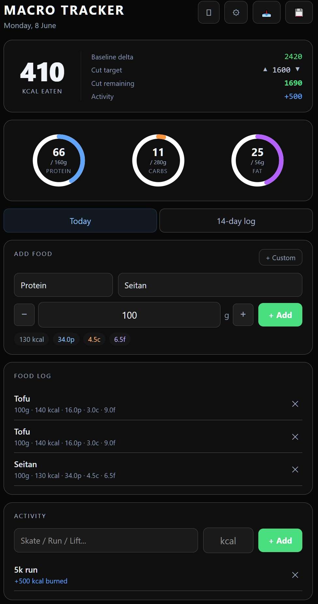

# Macro Tracker v2



Personal nutrition tracker with per-user auth, real-time Supabase sync, and a clean dark UI. Tracks daily macros against configurable targets, logs activity calories, and calculates cut deficit progress.

## Features

- **Magic link auth** — Supabase email auth, no passwords, per-user data isolation via RLS
- **Macro rings** — SVG progress rings for protein, carbs, fat vs. daily targets
- **Calorie summary** — eaten vs. BMR, baseline delta, cut target, cut remaining
- **Cut deficit calculator** — configurable deficit with inline editing
- **Food database** — categorised food DB (Protein, Carbs, Fats, Veg, Flavor, Beverages)
- **Custom food entry** — add any food by name, kcal/100g, grams eaten, protein/carbs/fat
- **Activity logging** — log activity with kcal burned, adds to daily budget
- **14-day history log** — scrollable history with per-day macro breakdown
- **CSV export** — daily / week / month / YTD with baseline delta column
- **JPEG export** — screenshot current state via html2canvas
- **Auto backup** — triggers at 20:00 and on page unload
- **Data import** — paste JSON from localStorage to migrate from older versions

## Stack

- React 18 + Vite
- Supabase (Postgres + Auth + RLS)
- html2canvas

## Run locally

```bash
npm install
npm run dev
```

Requires a Supabase project with a `macro_history` table and RLS enabled:

```sql
create table macro_history (
  id text primary key,
  data jsonb,
  updated_at timestamptz default now()
);

alter table macro_history enable row level security;

create policy "users own their data" on macro_history
  for all using (auth.uid()::text = id);
```

Add your Supabase URL and anon key to `src/supabaseClient.js`.

## Live demo

[macro-tracker-ofir.netlify.app](https://ornate-toffee-0ef2e9.netlify.app) — sign in required (magic link email)
